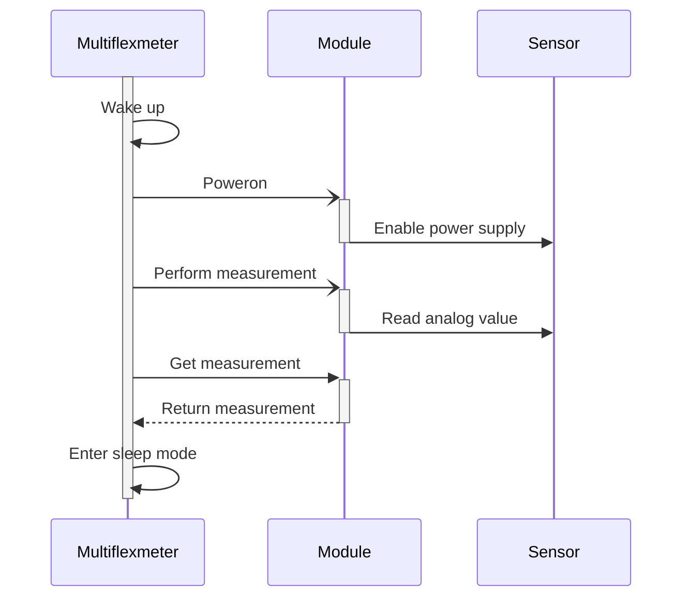

# Multiflexmeter Sensor Module

```mermaid
sequenceDiagram
  participant MFM as Multiflexmeter
  participant MOD as Module
  participant SEN as Sensor

  activate MFM
  MFM ->> MFM: Wake up

  MFM -) +MOD: Poweron
  MOD ->> -SEN: Enable power supply

  MFM -) +MOD: Perform measurement
  MOD ->> -SEN: Read analog value

  MFM ->> +MOD: Get measurement
  MOD -->> -MFM: Return measurement 

  MFM ->> MFM: Enter sleep mode
   
  deactivate MFM
```